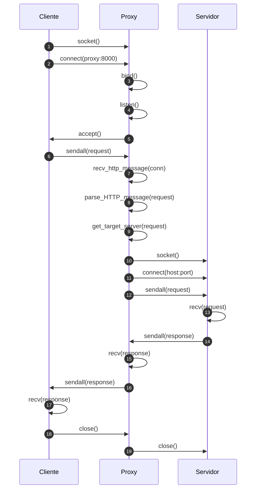

# Actividad: Construir un Proxy CC4303-1 Primavera 2026

En este archivo se documentará el desarrollo de la parte 2 de la actividad "Construir un Proxy" para Redes CC4304.

Vamos a continuar con la construcción del servidor proxy de la parte 1 de la actividad.
Las funcionalidades objetivo del servidor son:
- Bloquear tráfico hacia páginas no permitidas (como un control parental)
- Reemplazar contenido inadecuado (reemplazo el string A con el string B)

## Diagrama de flujo



## Paso 1
En el primer paso modificaremos el servidor para que cumpla su función como proxy, es decir, un intermediario entre el cliente y el servidor objetivo.

Recibimos una petición (Request) del cliente -> La envíamos al servidor de forma íntegra (sin modificaciones) -> recibimos la respuesta y se la enviamos al cliente, también sin modificaciones.

Siguiendo el flujo que creamos, usaremos dos funciones auxiliares (forward_http_message(request, host, port) y get_target_server(request)) que nos ayudaran a manejar tanto la petición como la respuesta HTTP, además de las funciones creadas en la parte 1 de la actividad como parse_http_message(http_message: bytes).

``` python
def get_target_server(request):
    """Extrae el host y el puerto al que debe ir el proxy.
    Para esta versión educativa, usamos el header Host del request.
    Ejemplo: Host: www.example.com:80
    """
    parsed_request = parse_HTTP_message(request)
    host_header = parsed_request.get("headers", {}).get("Host", "localhost")

    if ":" in host_header:
        host, port = host_header.rsplit(":", 1)
        return host, int(port)

    return host_header, 80
```

``` python
def forward_http_message(request, host, port=80):
    """Reenvia el request tal como llega al servidor upstream y devuelve la respuesta sin modificar."""
    upstream = socket.socket(socket.AF_INET, socket.SOCK_STREAM)
    upstream.connect((host, port))
    upstream.sendall(request)

    response = b""
    while True:
        message = upstream.recv(BUFFER_SIZE)
        if not message:
            break
        response += message

    upstream.close()
    return response
```

## Paso 2: bloqueo de dominios prohibidos

Para bloquear un dominio, el proxy lee el header `Host` de la request y lo
compara con la lista `blocked` del archivo JSON. Si el dominio está en
esa lista, el proxy no abre un socket hacia el servidor real. En su lugar,
responde directamente al cliente con `HTTP/1.1 403 Forbidden`.

Ejemplo de configuración:

```json
{
    "user": "--su email--",
    "blocked": [
        "www.example.com",
        "sitio-prohibido.cl/secret"
    ],
    "forbidden_words": [
        {"proxy": "[REDACTED]"},
        {"DCC": "[FORBIDDEN]"},
        {"biblioteca": "[???]"}
    ]
}
```

El proxy compara el dominio ignorando mayúsculas y también bloquea subdominios.
Por ejemplo, si se bloquea `example.com`, también se bloquea `www.example.com`.
Si la entrada contiene una ruta, como `sitio-prohibido.cl/secret`, se bloquea
solo esa combinación de dominio y ruta.

Las respuestas de sitios permitidos también se revisan usando
`forbidden_words`. Cada diccionario indica un reemplazo, por ejemplo,
`"proxy"` se convierte en `"[REDACTED]"`. Después del reemplazo, el proxy
calcula nuevamente `Content-Length` antes de responder.

La respuesta 403 contiene un HTML con una imagen local:

```html
HTTP/1.1 403 Forbidden
Content-Type: text/html; charset=utf-8

<h1>Acceso bloqueado</h1>

```

La imagen se encuentra localmente en `actividades/blocked_image.svg`. Cuando el
navegador recibe el HTML, realiza una segunda request para obtener la imagen:

```text
1. Cliente -> Proxy: request hacia el dominio bloqueado
     Proxy -> Cliente: respuesta 403 con el HTML

2. Cliente -> Proxy: GET /blocked_image.svg
     Proxy -> Cliente: imagen local
```

Por lo tanto, se necesitan **2 ciclos de comunicación HTTP** para mostrar la
imagen en el navegador:

1. Un ciclo para solicitar el dominio y recibir la respuesta 403.
2. Otro ciclo para solicitar y recibir la imagen referenciada por el HTML.

La imagen no se descarga desde el servidor bloqueado. El proxy la entrega
directamente desde su archivo local, por lo que en el segundo ciclo no se crea
una conexión con el servidor real.

## Paso 3: identificar al usuario en requests permitidas

Cuando el dominio y la ruta no están bloqueados, el proxy agrega el siguiente
header antes de enviar la request al servidor final:

```text
X-ElQuePregunta: --su email--
```

El valor se obtiene del campo `user` del archivo JSON. Por ejemplo, con esta
configuración:

```json
{
    "user": "email@example.com"
}
```

la request que sale del proxy incluye:

```http
GET / HTTP/1.1
Host: www.example.com
X-ElQuePregunta: email@example.com
```

Este header se agrega solamente a requests permitidas. Si el destino aparece
en `blocked`, el proxy responde con `403 Forbidden` y no establece la conexión
con el servidor final.

### Prueba con curl

Se ejecutaron las siguientes pruebas:

```bash
curl -i http://cc4303.bachmann.cl/
curl -i -x http://127.0.0.1:8000 http://cc4303.bachmann.cl/
```

Sin usar el proxy, la página respondió con el mensaje original:

```html
<h1>Bienvenide ... oh? no puedo ver tu nombre :c!</h1>
```

Al usar el proxy, la página respondió:

```html
<h1>Bienvenide usuario!</h1>
```

La diferencia confirma que el servidor remoto reconoció el header
`X-ElQuePregunta`. En esta prueba se utilizó el valor predeterminado
`usuario`, porque no había un archivo `config.json` en el directorio de
ejecución. Con el archivo de configuración de la actividad, el valor será el
contenido del campo `user`.

## Paso 4: reemplazo de contenido inadecuado

Después de recibir una respuesta del servidor final, el proxy revisa su body
buscando cada string definido en `forbidden_words`. Cada elemento del arreglo
es un diccionario donde la clave es el string A y el valor es el string B:

```json
"forbidden_words": [
    {"proxy": "[REDACTED]"},
    {"DCC": "[FORBIDDEN]"},
    {"biblioteca": "[???]"}
]
```

Por ejemplo, si la respuesta contiene:

```html
<p>El proxy pertenece al DCC y esta cerca de la biblioteca.</p>
```

el proxy la envía al cliente como:

```html
<p>El [REDACTED] pertenece al [FORBIDDEN] y esta cerca de la [???].</p>
```

El reemplazo se realiza antes de enviar la respuesta al cliente. Como el
tamaño del body puede cambiar, el proxy calcula nuevamente el header
`Content-Length`. Si la respuesta no contiene texto válido, se entrega sin
modificaciones para no corromper contenido binario.

### Prueba con curl

Con el JSON de configuración de la actividad, se ejecutó:

```bash
curl -i -x http://127.0.0.1:8000 http://cc4303.bachmann.cl/replace
```

La respuesta fue `HTTP/1.1 200 OK` y el contenido HTML mostró los reemplazos:

```html
<title>¿Qué es un [REDACTED]?</title>
...
el [REDACTED] del [FORBIDDEN]
...
a una [???]
```

La respuesta llegó completa y conservó sus headers HTTP. El header
`Content-Length` informado fue `1225`, correspondiente al body después de los
reemplazos. Esto confirma que el proxy modificó el contenido textual sin
generar errores en la respuesta.

## Paso 5: recepción con un buffer menor que el mensaje

Para esta etapa el proxy utiliza un buffer de recepción de solo `64` bytes:

```python
BUFFER_SIZE = 64
```

El tamaño del buffer no limita el tamaño del mensaje. `recv()` entrega como
máximo un fragmento de ese tamaño, por lo que el proxy concatena los
fragmentos en `full_message` hasta saber que el mensaje terminó.

### ¿Cómo sé si llegó el mensaje completo?

HTTP entrega dos datos para determinarlo:

1. El HEAD termina cuando aparece la secuencia `\r\n\r\n`.
2. El BODY termina cuando se han recibido tantos bytes como indica el header
    `Content-Length`.

Si el mensaje es mayor que el buffer, se ejecutan varios `recv()` y cada
fragmento se agrega al mensaje acumulado. El proxy no interpreta cada fragmento
como un mensaje separado.

### ¿Qué pasa si los headers no caben en mi buffer?

No hay un problema especial. El proxy continúa llamando `recv()` y acumulando
los fragmentos. Los headers pueden ocupar muchos buffers. Solo cuando la
secuencia `\r\n\r\n` aparece en el acumulado se considera terminado el HEAD.

### ¿Cómo sé que el HEAD llegó completo?

Se busca `\r\n\r\n` dentro de `full_message`. Esa secuencia representa la línea
vacía que separa los headers del body:

```text
Header-1: valor\r\n
Header-2: valor\r\n
\r\n
BODY
```

El separador puede estar dividido entre dos llamadas a `recv()`, por eso se
busca en el mensaje acumulado y no solo en el último fragmento.

### ¿Cómo sé que el BODY llegó completo?

Después de encontrar el final del HEAD, se calcula cuántos bytes del BODY ya
fueron recibidos. Luego se sigue leyendo mientras:

```text
bytes_body_recibidos < Content-Length
```

Cuando ambos valores son iguales, el mensaje está completo. Esto también
funciona si el último fragmento contiene una parte del HEAD y otra parte del
BODY.

En las respuestas del servidor final se usa la misma idea: `forward_http_message`
acumula fragmentos, encuentra el HEAD y deja de leer cuando recibe el body
indicado por `Content-Length`. Así no depende de que el servidor cierre la
conexión, lo que permite trabajar con respuestas `keep-alive`.

### Prueba con mensajes mayores que el buffer

Se probó `recv_http_message` con un buffer de `7` bytes, un HEAD de varias
líneas y un BODY de `120` bytes. El request completo tenía `219` bytes y el
resultado fue:

```text
REQUEST_COMPLETE: True
BODY_BYTES: 120
```

Esto confirma que el proxy recibe correctamente mensajes cuyo HEAD y BODY son
mayores que el buffer de recepción.

### Prueba con curl usando el buffer pequeño

Se inició el proxy con `BUFFER_SIZE = 64` y se ejecutó:

```bash
curl -i -x http://127.0.0.1:8000 http://cc4303.bachmann.cl/replace
```

La respuesta fue recibida correctamente:

```text
HTTP/1.1 200 OK
Content-Length: 1155
```

El HTML completo llegó al cliente, incluyendo el título y el párrafo de la
página. No hubo truncamiento ni errores de conexión. Esto confirma mediante
una prueba real que el proxy puede recibir y reenviar una respuesta mayor que
su buffer, acumulando los fragmentos hasta completar el body indicado por
`Content-Length`.

## Ejecución y uso con un navegador

El archivo `config.json` debe estar en la raíz del proyecto, porque el
programa lo abre directamente. Inicie el proxy desde esa carpeta:

```bash
cd /ruta/a/redes_CC4303
python actividades/http_server.py
```

El proxy escuchará en `127.0.0.1:8000`.

Para probarlo con un navegador, abra `Ajustes -> General -> Configuración de red ->
Configurar`, seleccione `Configuración manual del proxy` y escriba:

```text
Proxy HTTP: 127.0.0.1
Puerto: 8000
```

Desactive las excepciones para que las solicitudes de prueba pasen por el
proxy. Luego visite:

```text
http://cc4303.bachmann.cl/
http://cc4303.bachmann.cl/replace
http://cc4303.bachmann.cl/secret
```

Para detener el servidor, vuelva a la terminal y presione `Ctrl+C`. Al
finalizar, restaure la configuración de red del navegador.

## Revisión final y observaciones

El flujo de decisiones del proxy es:

1. Recibir y acumular la request hasta completar HEAD y BODY.
2. Obtener el host y el path.
3. Revisar `blocked` antes de abrir el socket hacia el servidor final.
4. Responder `403 Forbidden` con la imagen local si el destino está bloqueado.
5. Agregar `X-ElQuePregunta` y reenviar la request si el destino está permitido.
6. Reemplazar `forbidden_words` en la respuesta y enviarla al navegador.

Con `curl --noproxy ""`, los resultados observados fueron:

| URL | Resultado | Observación |
| --- | --- | --- |
| `/` | `200 OK` | La página se muestra y el servidor reconoce `X-ElQuePregunta`. |
| `/replace` | `200 OK` | La página se muestra con las palabras prohibidas censuradas. |
| `/secret` | `403 Forbidden` | Se muestra el HTML de bloqueo con la imagen local. |

La primera prueba directa de `/secret` sin proxy puede mostrar el contenido
original. La restricción se verifica al solicitarlo a través del proxy.

También se probaron los dos casos de buffer solicitados:

1. Buffer de `64` bytes, mensaje de `289` bytes y headers menores que el
    buffer: `True`.
2. Buffer de `8` bytes, headers mayores que el buffer y start line de `14`
    bytes: `True`.

En ambos casos el mensaje se reconstruyó completo con varios `recv()`, sin
perder headers ni BODY. El final del HEAD se detectó con `\r\n\r\n` y el final
del BODY con `Content-Length`.